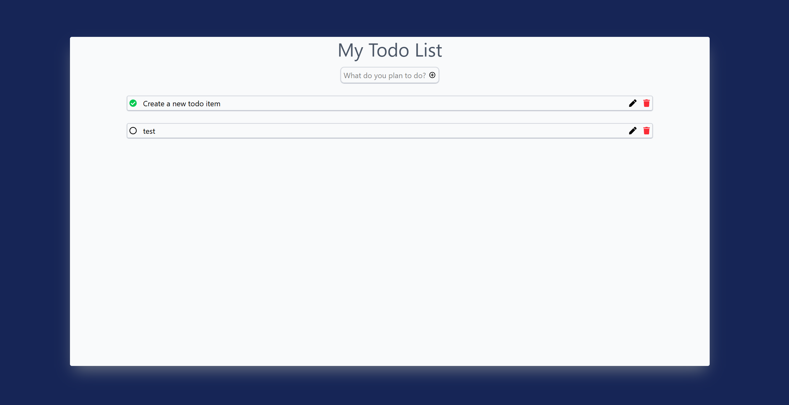
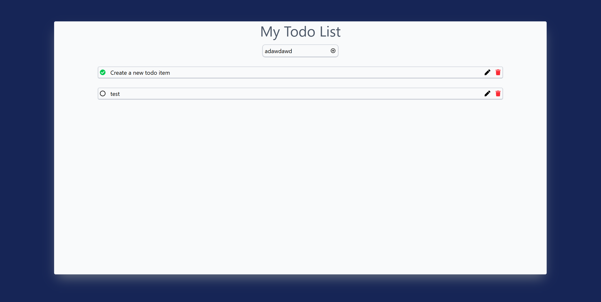
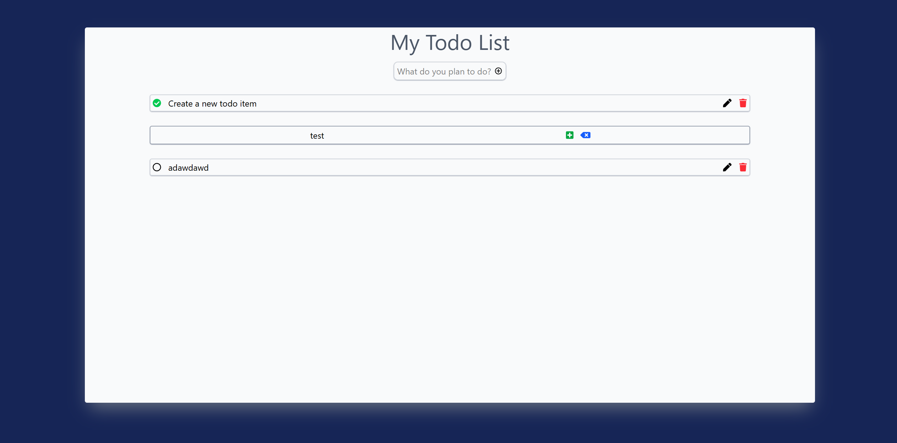
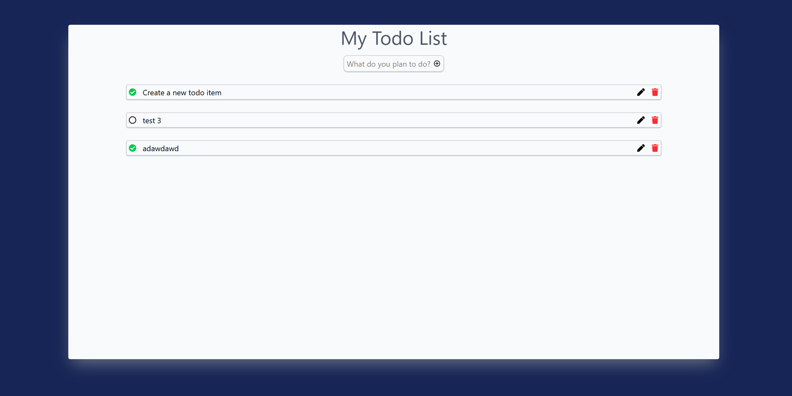

# New To Do List App using PERN stack 

---
Took a break due to life issues, trying smaller projects to rebuild and relearn core abilities and reactive design.
---

## Backend modules

---
* pg
* express
* cors
---

## Frontend modules using vite build

---
* react-icons
* tailwind css
* axios
---

### 🫵