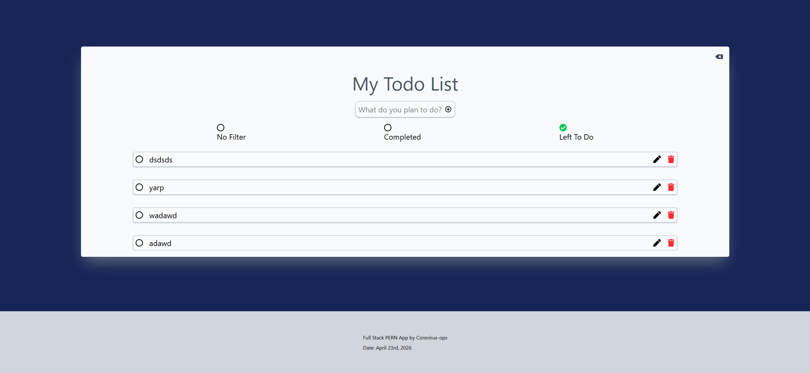
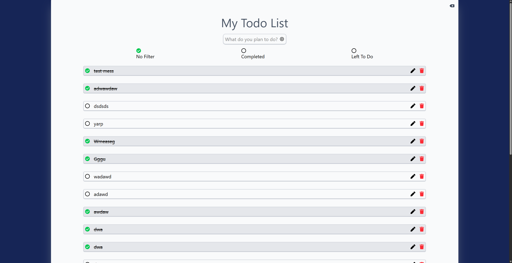
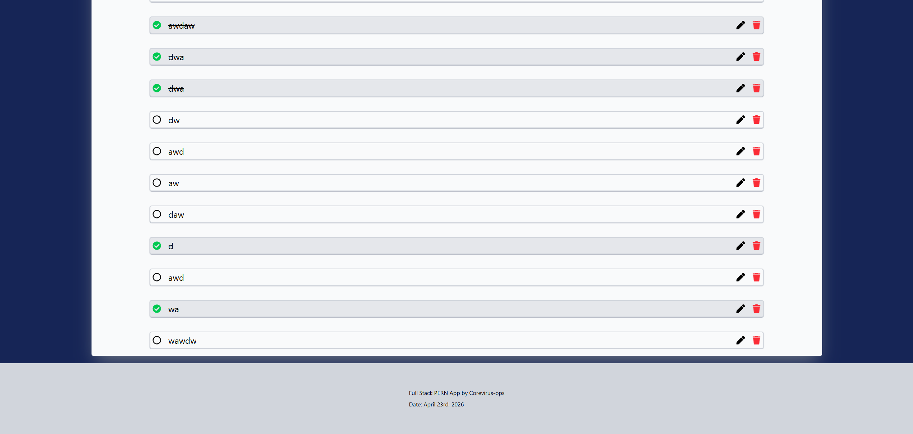

# New To Do List App using PERN stack 

---
Took a break due to life issues, trying smaller projects to rebuild and relearn core abilities and reactive design.

 A Simple to do list with filtering, login, and user management. Make To Dos and separate using active, or completed using MVC architechture

## Backend modules

---
* pg
* express
* cors
* passportjs
* express-session
* bcryptjs
---

## Frontend modules using vite build

---
* react-icons
* tailwind css
* axios
* react-router-dom
---

### 🫵

#### Next Steps
* Integrate Facebook and Goole Login / Sign Up Options
* Phase in some form of Navbar for further complexity